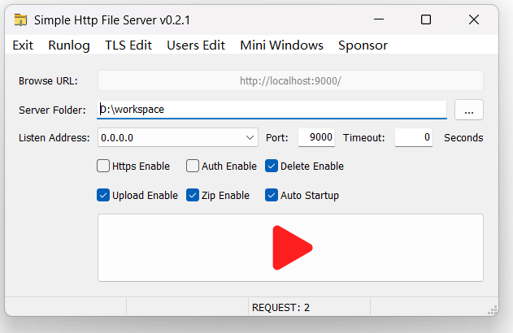
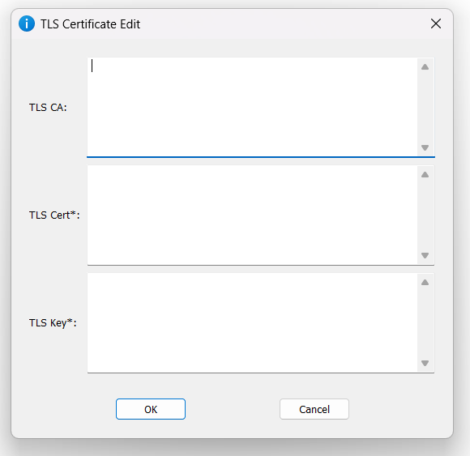
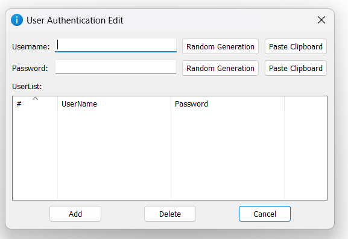
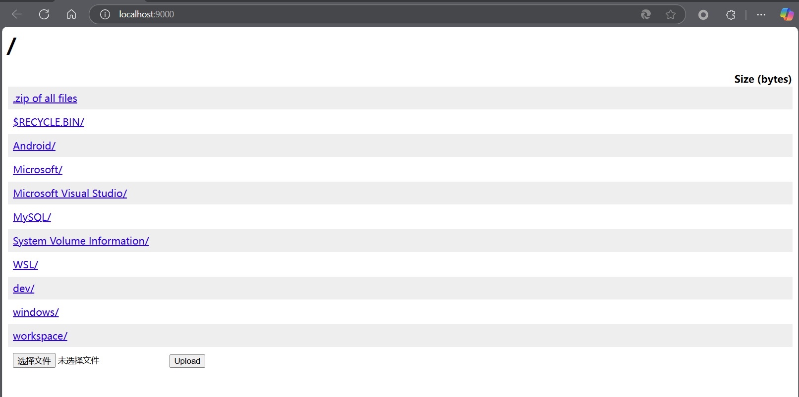

# 简易HTTP文件服务器

## 软件版本 v0.2

## 1. 软件架构

简易HTTP文件服务器是一种基于HTTP协议的文件共享工具，允许用户通过网络在不同设备或系统之间共享文件。它通常用于开发、测试、团队协作等场景，能够快速搭建一个轻量级的文件服务器，方便用户上传、下载和管理文件。以下是该软件的详细功能说明：

### 1.1 服务器配置

- **监听地址**：用户可以设置服务器的监听地址（如0.0.0.0表示监听所有网络接口，或指定某个IP地址）。
- **端口设置**：用户可以自定义服务器的监听端口（如默认的HTTP端口9000）。
- **共享文件夹**：用户可以指定服务器共享的文件夹路径，服务器会将此文件夹中的文件通过HTTP协议对外提供访问。

### 1.2 HTTPS支持

- **启用HTTPS**：用户可以选择启用HTTPS加密协议，确保文件传输的安全性。启用HTTPS需要配置SSL证书和私钥。
- **证书配置**：用户可以上传自定义的SSL证书，或使用自签名证书进行加密通信。

### 1.3 用户认证

- **启用认证**：用户可以启用用户认证功能，限制只有授权用户才能访问文件。
- **用户管理**：支持添加、删除用户，并为每个用户设置独立的用户名和密码。

### 1.4 文件管理功能

- **文件浏览**：用户可以通过浏览器访问文件服务器，查看共享文件夹中的文件列表。
- **文件下载**：用户可以直接下载共享文件夹中的文件。
- **文件上传**：如果启用上传功能，用户可以通过浏览器或工具（如curl）上传文件到服务器。
- **文件删除**：如果启用删除功能，用户可以通过界面或API删除共享文件夹中的文件。

### 1.5 应用场景

- **开发与测试**：开发人员可以快速搭建一个临时文件服务器，用于测试文件上传、下载等功能。
- **团队协作**：团队成员可以通过文件服务器共享资料，上传和下载文件，提高协作效率。
- **文件分发**：在需要分发文件的场景中（如软件安装包、文档等），可以通过文件服务器快速提供下载链接。
- **临时共享**：在需要临时共享文件的场景中（如会议、培训等），文件服务器可以快速满足需求。

## 2. 编译过程

### 2.1 准备环境

- 系统 Windows 10/11 64位
- [Golang SDK](https://studygolang.com/dl/golang/go1.23.3.windows-amd64.msi)

### 2.2 准备工具

```
go install github.com/akavel/rsrc@latest
go install github.com/GeertJohan/go.rice@latest
go install github.com/GeertJohan/go.rice/rice@latest
```

### 2.3 克隆代码

```
git clone https://github.com/linimbus/simple-http-server-windows.git
```

### 2.4 编译脚本

```
.\build.bat
```

## 3. 使用手册

### 3.1 软件主界面概述

简易HTTP文件服务器软件界面，用于设置和管理HTTP文件服务器相关参数。



#### 3.1.1 界面布局和内容

1. **标题栏**：显示软件名称。
2. **菜单栏**：包含`Exit`、`Runlog`、`TLS Edit`、`Users Edit`、`Mini Windows`和`Sponsor`选项。
3. **配置区域**：
    - **Browse URL（浏览网址）**：文本框显示`http://localhost:9000/`，这是服务器的本地访问地址，端口为9000。
    - **Server Folder（服务器文件夹）**：文本框显示`D:\workspace`，表示服务器共享的文件夹路径。右侧有`...`按钮，可用于浏览选择文件夹。
    - **Listen Address（监听地址）**：下拉框显示`0.0.0.0`，服务器监听网络接口。
    - **Port（端口）**：文本框显示`9000`，服务器使用的端口号。
    - **Timeout（超时）**：文本框显示`0`，单位为秒，连接超时时间。
    - **Https Enable（启用HTTPS）**：复选框，用于启用HTTPS协议。
    - **Auth Enable（启用认证）**：复选框，用于启用用户认证功能。
    - **Delete Enable（启用删除）**：复选框，允许用户在服务器上删除文件。
    - **Upload Enable（启用上传）**：复选框，允许用户上传文件到服务器。
    - **Zip Enable（启用压缩）**：复选框，允许对文件进行压缩操作。
    - **Auto Startup（自动启动）**：复选框，允许服务器启动时自动运行。
4. **操作按钮**：界面下方有一个红色按钮，用于启动服务器。
5. **状态栏**：底部状态栏，提供请求数量记录。

### 3.2 证书配置界面概述

证书编辑窗口界面，用于编辑HTTPS（传输层安全）相关证书信息，以便在网络通信中实现安全加密。



#### 3.2.1 界面布局和内容

1. **编辑区域**：
   - **TLS CA**：用于输入TLS证书颁发机构（Certificate - Authority，CA）的相关信息，CA证书用于验证服务器证书的合法性。
   - **TLS Cert**：用于输入TLS服务器证书（Certificate）的内容，服务器证书用于向客户端证明服务器的身份。
   - **TLS Key**：用于输入TLS私钥（Key）的内容，目前为空。私钥与服务器证书配合使用，用于加密和解密通信数据。

2. **操作按钮**：
   - **OK**：
     - 点击该按钮将保存输入的TLS证书相关信息并关闭窗口。
   - **Cancel**：
     - 点击该按钮将取消输入操作，关闭窗口且不保存任何信息。

### 3.3 用户配置界面概述



用于管理用户认证相关的设置，确保只有授权用户能够访问相关服务。

#### 3.3.1 界面布局和内容

1. **用户信息输入区域**：
    - **Username**：
        - 一个文本框，用于输入用户名。
        - 旁边有两个按钮，`Random Generation`用于自动生成用户名，`Paste Clipboard`用于从剪贴板粘贴用户名。
    - **Password**：
        - 一个文本框，用于输入密码。
        - 旁边同样有`Random Generation`和`Paste Clipboard`两个按钮，功能与用户名对应的按钮类似。

2. **用户列表区域**：
    - **UserList**：
        - 这是一个表格，用于显示已添加的用户信息。
        - 表格有两列，分别是`UserName`和`Password`，目前表格为空。

3. **操作按钮**：
    - **Add**：按钮，用于将输入的用户名和密码添加到用户列表中。
    - **Delete**：按钮，用于删除在用户列表中选中的用户。
    - **Cancel**：按钮，用于取消当前操作并关闭窗口，不保存任何更改。

### 3.4 测试

在浏览器中访问本地HTTP文件服务器（例如地址：`localhost:9000`），展示服务器指定文件夹下的文件和目录结构，同时提供文件上传功能。



### 3.4.1 界面布局和内容

1. **地址栏**：显示当前访问的网址`localhost:9000`，表明用户正在访问本地服务器的`9000`端口。

2. **文件和目录列表**：
    - 页面左侧以蓝色超链接形式列出了多个目录名称，点击这些链接可进入相应目录查看其中内容。
    - 上方还有一个`_zip of all files`链接，可能是用于下载所有文件的压缩包。
    - 右侧有`Size (bytes)`标题，用于显示文件或目录大小，但当前列表中未显示具体大小数值。

3. **文件上传区域**：
    - 下方有`选择文件`按钮和`未选择文件`提示，表明当前未选择任何文件。
    - `Upload`按钮用于将选择的文件上传至服务器。
